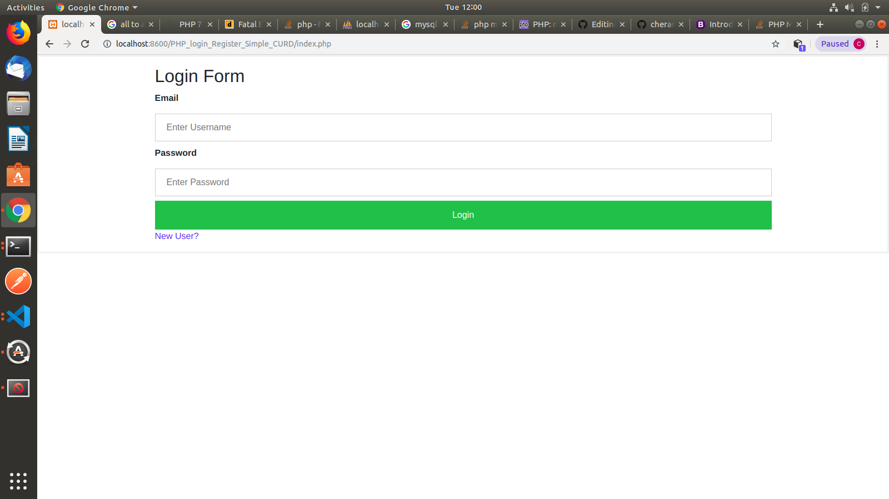
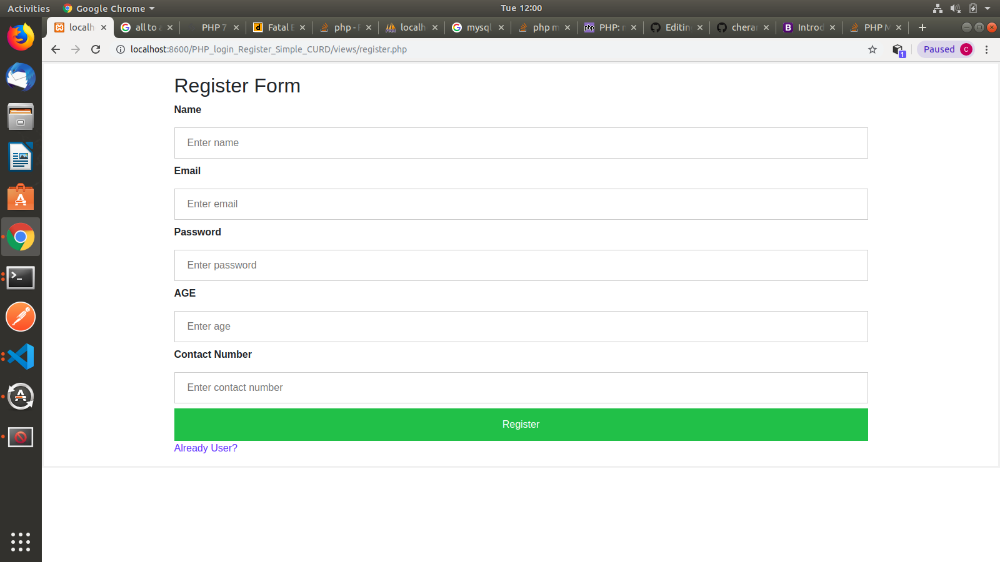
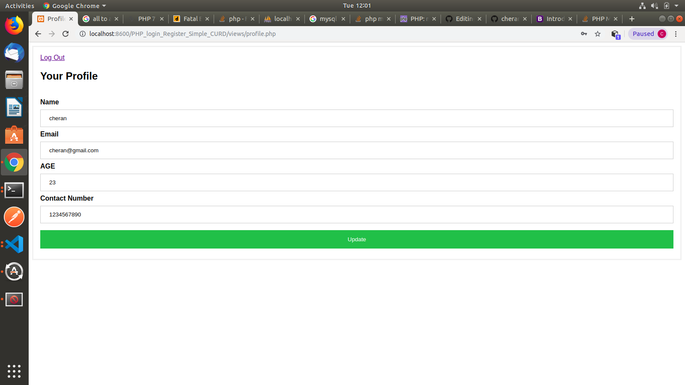

# PHP_login_Register_Simple_CURD

This is the source for Simple Login , Register and Profile Update System.

Project Scope:

1. Created Signup page where user can register and login page to login with the details provided during registration.
2. After Login successfull redirect to Profile page and displaying logged user details as well as user can update thier details.

Followed Constraints :

1. HTML,CSS, JS and common files separted.
2. Used Boostrap for mobile responsive.
3. User Jquery for DOM manipulations.
4. AJAX Call for form submit
5. JSON followed for transfer data from client side in to server side.
6. User data stored in MysqlDB and also in the JSON file.
7. Used Prepared Statements while perfoming MYSQL Quires.

